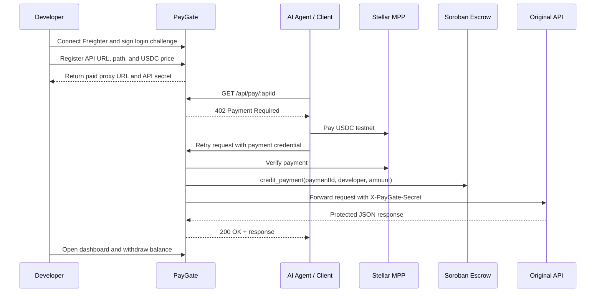
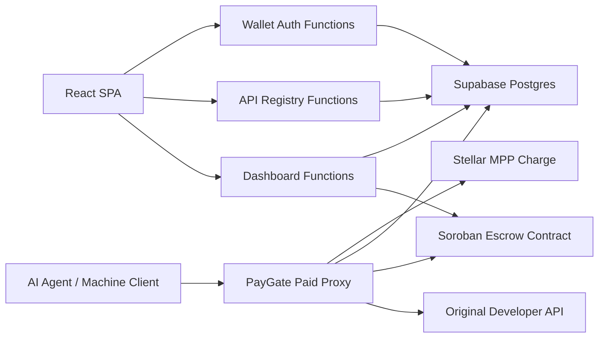

# PayGate

PayGate is a **pay-per-call gateway for APIs on Stellar testnet**.

It lets a developer register a normal API, expose it through a PayGate paid proxy, let AI agents or machine clients pay per request through Stellar MPP, and track revenue, fees, calls, and withdrawals from a developer dashboard.

PayGate V1 is a **testnet beta candidate**. It is designed to prove the product loop, not to handle mainnet funds yet.

[Detailed Docs](docs/README.md) · [V1 Product Spec](docs/PAYGATE_V1_PRODUCT_SPEC.md) · [Demo Guide](docs/PAYGATE_V1_DEMO_GUIDE.md) · [Beta Readiness](docs/evidence/PAYGATE_V1_BETA_READINESS.md) · [OpenSpec](openspec/README.md)


---

## Table of Contents

- [What Is PayGate?](#what-is-paygate)
- [Why This Matters](#why-this-matters)
- [Current Status](#current-status)
- [Review Path](#review-path)
- [Core Flow](#core-flow)
- [Architecture](#architecture)
- [Features](#features)
- [API Surface](#api-surface)
- [Local Development](#local-development)
- [Environment Variables](#environment-variables)
- [Supabase Setup](#supabase-setup)
- [Deployment](#deployment)
- [Verification Checklist](#verification-checklist)
- [Demo Evidence](#demo-evidence)
- [Project Structure](#project-structure)
- [V1 Boundaries](#v1-boundaries)
- [Roadmap](#roadmap)
- [References](#references)

---

## What Is PayGate?

PayGate is a gateway layer for developers who want to monetize API calls without building payment infrastructure from scratch.

Instead of asking API buyers to subscribe, create accounts, or go through human-style checkout, PayGate exposes a paid proxy endpoint:

```text
AI agent / machine client
-> PayGate paid proxy
-> original developer API
```

The developer keeps their API normal. PayGate handles:

- Freighter wallet login for developer identity.
- API registration and paid proxy generation.
- HTTP `402 Payment Required` challenges.
- Stellar MPP payment verification.
- Soroban escrow crediting.
- 90% developer / 10% PayGate fee split.
- Dashboard reporting.
- Developer withdrawal.

The original SOW/V0 code generator still exists at `/generate`, but it is now treated as a legacy helper. The main V1 product flow starts at `/dashboard` and `/apis/new`.

---

## Why This Matters

Most API monetization assumes a human buyer:

1. create an account,
2. enter a card,
3. choose a plan,
4. manage subscription billing,
5. then call the API.

That flow is awkward for AI agents and machine clients. Agents need something more direct:

1. request a resource,
2. receive a payment challenge,
3. pay for that single call,
4. retry with proof,
5. receive the API response.

PayGate demonstrates that pattern with Stellar testnet USDC, MPP, and a PayGate-controlled paid gateway.

---

## Current Status

PayGate V1 currently supports the full testnet beta loop locally and in deploy-ready code:

| Area | Status |
|---|---|
| Freighter wallet login | Done |
| Supabase-backed auth challenges | Done |
| API registry | Done |
| API secret encryption | Done |
| Paid proxy `/api/pay/:apiId` | Done |
| MPP unpaid `402` flow | Done |
| MPP paid `200` flow | Done, testnet proof captured |
| Soroban escrow contract | Done for testnet demo |
| 90% developer / 10% PayGate split | Done |
| Dashboard summary | Done |
| Developer withdrawal | Done |
| Platform fee withdrawal command | Done |
| Beta evidence package | Done |
| Production live replay | Pending |
| Demo video | Pending |

Read the current readiness note in [docs/evidence/PAYGATE_V1_BETA_READINESS.md](docs/evidence/PAYGATE_V1_BETA_READINESS.md).

---

## Review Path

For a reviewer or demo session, the shortest path is:

1. Open the deployed PayGate app.
2. Connect Freighter on Stellar Testnet.
3. Open `/apis/new` and register the demo upstream API.
4. Copy the generated proxy URL and API secret.
5. Set `PAYGATE_DEMO_UPSTREAM_SECRET` to the generated secret.
6. Call the original upstream without the secret and confirm `401`.
7. Call the PayGate proxy without payment and confirm `402`.
8. Run the local agent/client to pay with testnet USDC.
9. Confirm the proxy returns `200` with the upstream JSON response.
10. Open `/dashboard` and verify calls, payment tx, credit tx, revenue, fee, and withdrawable balance.
11. Withdraw developer balance with Freighter.

The detailed replay script lives in [docs/PAYGATE_V1_DEMO_GUIDE.md](docs/PAYGATE_V1_DEMO_GUIDE.md).

---

## Core Flow



---

## Architecture



### Stack

- **Frontend:** React 18, Vite, React Router, Tailwind CSS, lucide-react.
- **API runtime:** Vercel Functions in `api/`.
- **Legacy generator backend:** Express in `backend/`.
- **Database:** Supabase Postgres.
- **Payments:** `@stellar/mpp`, `mppx`, Stellar testnet USDC.
- **Settlement:** Soroban escrow contract.
- **Wallet:** Freighter.
- **Demo client:** Node.js script in `examples/express-paid-api`.

---

## Features

### Developer Side

- Connect Freighter wallet.
- Sign a challenge to prove wallet ownership.
- Register a GET JSON API.
- Set price per call in USDC.
- Receive a PayGate paid proxy URL.
- Receive a unique `X-PayGate-Secret` for upstream protection.
- Toggle API active/inactive.
- See API calls, successful calls, failed calls, and payment history.
- See gross revenue, developer revenue, and PayGate fee.
- Withdraw escrow balance with a Freighter-signed transaction.

### Agent / Buyer Side

- Call a paid proxy endpoint.
- Receive HTTP `402 Payment Required` when unpaid.
- Pay Stellar testnet USDC through MPP.
- Retry the request with payment proof.
- Receive the upstream API response after settlement.

### PayGate Operator Side

- Verify MPP payment credentials.
- Credit the Soroban escrow ledger.
- Track request and payment state in Supabase.
- Withdraw accumulated platform fees.
- Generate evidence for grant/demo review.

---

## API Surface

| Method | Path | Description |
|---|---|---|
| `POST` | `/api/generate` | Legacy V0 middleware generator |
| `GET` | `/api/auth/me` | Reads the current wallet session |
| `POST` | `/api/auth/challenge` | Creates a Freighter sign-message challenge |
| `POST` | `/api/auth/verify` | Verifies the signed challenge and creates a session |
| `POST` | `/api/auth/logout` | Clears the wallet session |
| `GET` | `/api/apis` | Lists APIs owned by the connected wallet |
| `POST` | `/api/apis` | Registers a new API |
| `GET` | `/api/apis/:apiId` | Reads one registered API |
| `PATCH` | `/api/apis/:apiId` | Updates API name or active state |
| `GET` | `/api/pay/:apiId` | Paid proxy endpoint |
| `GET` | `/api/dashboard/summary` | Dashboard summary for the connected wallet |
| `POST` | `/api/withdraw/prepare` | Prepares a Freighter-signed withdrawal transaction |
| `POST` | `/api/withdraw/submit` | Submits a signed withdrawal transaction |
| `GET` | `/api/upstream/market-signal` | Secret-protected demo upstream API |
| `GET` | `/api/demo/market-signal` | Legacy standalone paid sample API |

### Register API Example

```http
POST /api/apis
Content-Type: application/json
Cookie: paygate_session=...
```

```json
{
  "name": "PayGate Demo Market Signal",
  "upstreamBaseUrl": "https://your-paygate-domain.vercel.app",
  "path": "/api/upstream/market-signal",
  "priceUsdc": 0.01
}
```

Example response:

```json
{
  "api": {
    "id": "api_id",
    "name": "PayGate Demo Market Signal",
    "proxyUrl": "https://your-paygate-domain.vercel.app/api/pay/api_id",
    "secret": "pgsec_..."
  }
}
```

### Paid Proxy Example

```http
GET /api/pay/:apiId
```

Without payment, PayGate returns HTTP `402 Payment Required`. A compatible MPP client pays, retries with the payment credential, and receives the upstream JSON response.

---

## Local Development

Use Node.js 22+ locally.

```bash
npm install
npm --prefix frontend install
vercel env pull .env.local --environment=development --yes
vercel dev
```

Open:

```text
http://localhost:3000
```

Verify that V1 API functions are loaded:

```bash
curl -i http://localhost:3000/api/auth/me
```

Expected before login:

```json
{"authenticated":false}
```

If this request logs a Vite proxy `ECONNREFUSED`, your linked Vercel project is still using `frontend` as the Root Directory. Change the Vercel project Root Directory to the repo root.

### Frontend-Only Visual Mode

Use this only for visual checks. It does not load V1 API functions.

```bash
cd frontend
npm install
npm run dev
```

Open:

```text
http://localhost:5173
```

---

## Environment Variables

Copy the template:

```bash
cp .env.example .env.local
```

Required server env for V1:

```bash
SUPABASE_URL=
SUPABASE_SERVICE_ROLE_KEY=
SESSION_SECRET=
API_SECRET_ENCRYPTION_KEY=
MPP_SECRET_KEY=
ESCROW_CONTRACT_ID=
PAYGATE_OPERATOR_SECRET=
PAYGATE_DEMO_UPSTREAM_SECRET=
STELLAR_NETWORK=stellar:testnet
STELLAR_RPC_URL=https://soroban-testnet.stellar.org
```

Generate strong random secrets:

```bash
node -e "console.log(require('crypto').randomBytes(32).toString('hex'))"
```

Important rules:

- Do not commit `.env.local`.
- Do not put payer wallet secrets in Vercel.
- `STELLAR_SECRET` belongs only in the local agent/client environment.
- Do not use `PAYGATE_AUTH_CHALLENGE_STORE=memory` or `PAYGATE_REGISTRY_STORE=memory` in Vercel.

---

## Supabase Setup

Run these migrations in the Supabase SQL Editor:

```text
supabase/migrations/20260604000000_paygate_v1_registry.sql
supabase/migrations/20260604000001_paygate_v1_paid_proxy.sql
```

They create the V1 storage layer:

```text
developers
auth_challenges
apis
proxy_requests
payments
withdrawals
mpp_store
```

Use the Supabase service role key only on the server side.

---

## Deployment

PayGate is intended to run as a single Vercel project from the repo root.

Vercel project settings:

```text
Root Directory: repo root
Build Command: npm run build
Output Directory: frontend/dist
Install Command: npm install
Node.js Version: 22.x or 24.x
```

Check the linked project:

```bash
vercel project inspect paygate-stellar
```

The output must not show:

```text
Root Directory: frontend
```

If it does, `/api/*` will fall through to the Vite frontend proxy instead of loading Vercel Functions.

After setting env vars in Vercel:

```bash
vercel env pull .env.local --environment=development --yes
```

---

## Verification Checklist

Run from the repo root:

```bash
npm run test:beta
npm run audit:prod
npm run test:browser
git diff --check
```

Optional deployed readiness checks:

```bash
npm run beta:preflight
npm run test:auth:supabase
```

Quick API checks:

```bash
curl -i http://localhost:3000/api/auth/me
curl -i http://localhost:3000/api/upstream/market-signal
curl -i http://localhost:3000/api/pay/<apiId>
```

Expected behavior:

- `/api/auth/me` returns `{"authenticated":false}` before login.
- `/api/upstream/market-signal` returns `401` without `X-PayGate-Secret`.
- `/api/pay/<apiId>` returns `402` without payment.
- A paid agent/client retry returns `200` with the protected JSON response.

---

## Demo Evidence

Existing testnet evidence is tracked under `docs/evidence/`.

| Evidence | File |
|---|---|
| Escrow deploy/init/withdraw/platform fee | [Phase 1 settlement proof](docs/evidence/PAYGATE_V1_PHASE1_SETTLEMENT_PROOF.md) |
| Wallet auth | [Phase 2 wallet auth proof](docs/evidence/PAYGATE_V1_PHASE2_WALLET_AUTH_PROOF.md) |
| API registry | [Phase 3 registry proof](docs/evidence/PAYGATE_V1_PHASE3_REGISTRY_PROOF.md) |
| Upstream API protection | [Phase 4 upstream proof](docs/evidence/PAYGATE_V1_PHASE4_UPSTREAM_API_PROOF.md) |
| Unpaid proxy `402` | [Phase 5 unpaid proxy proof](docs/evidence/PAYGATE_V1_PHASE5_PROXY_UNPAID_PROOF.md) |
| Paid proxy `200` and escrow credit | [Phase 6 paid proxy proof](docs/evidence/PAYGATE_V1_PHASE6_PAID_PROXY_PROOF.md) |
| Dashboard | [Phase 7 dashboard proof](docs/evidence/PAYGATE_V1_PHASE7_DASHBOARD_PROOF.md) |
| Withdrawal | [Phase 8 withdrawal proof](docs/evidence/PAYGATE_V1_PHASE8_WITHDRAWAL_PROOF.md) |

Important testnet tx hashes already captured:

| Action | Tx hash |
|---|---|
| Agent pays escrow through MPP | `c7cc23efa9130c1178343d22bd98a0fd5f6e23fde2a2224715a0a7a99b3734a6` |
| PayGate credits escrow ledger | `db5e1e1c6d9e6b9d24887ac96cb18a227fd7866d044da6d0db8ccc45c8708ee1` |
| Developer withdraw proof | `8f0647f5595020a394df833b1545e2d4c0e192af960db2b1e3c68dfd679d50d7` |
| Platform fee withdraw proof | `0bf30b3fd0b5385f933dd9b22de39a6c8167e2c6405ac075a2bd13466a26d04b` |

Create a new replay folder:

```bash
npm run evidence:init
```

---

## Project Structure

```text
paygate/
├── api/                       # Vercel Functions for V1 auth, registry, proxy, dashboard, withdrawal
├── backend/                   # Legacy Express generator backend
├── contracts/                 # Soroban escrow contract
├── docs/                      # Specs, demo guide, handoff docs, evidence
├── examples/express-paid-api  # Demo API and local agent/client
├── frontend/                  # React SPA
├── openspec/                  # OpenSpec changes and capability specs
├── scripts/                   # Smoke tests, beta preflight, evidence tooling
├── supabase/                  # SQL migrations
├── package.json
└── vercel.json
```

---

## V1 Boundaries

- Testnet only.
- USDC only.
- GET JSON APIs only.
- Buyer is represented by a local script/agent client.
- No buyer account system yet.
- No prepaid balance yet.
- No refund flow if upstream fails after payment.
- No mainnet, fiat checkout, compliance workflow, or production incident response yet.

---

## Roadmap

- Complete deployed Vercel replay with real env and screenshots.
- Record a concise demo video.
- Add POST/body forwarding.
- Add refund or pending-credit handling for upstream failure.
- Add buyer-side UX or agent SDK.
- Add mainnet readiness review.
- Add provider onboarding polish and API secret rotation.
- Add analytics, webhooks, and richer dashboard filters.

---

## References

- [Stellar MPP documentation](https://developers.stellar.org/docs/build/agentic-payments/mpp)
- [Stellar MPP Charge guide](https://developers.stellar.org/docs/build/agentic-payments/mpp/charge-guide)
- [Freighter web app API](https://docs.freighter.app/docs/guide/usingfreighterwebapp/)
- [Vercel environment variables](https://vercel.com/docs/environment-variables)
- [Supabase documentation](https://supabase.com/docs)

## License

MIT © 2026 PayGate
