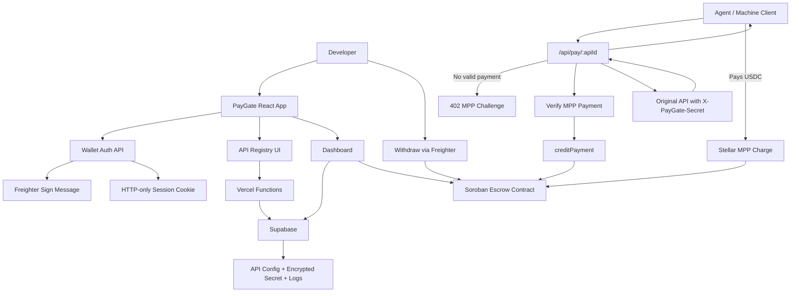

# PayGate V1 Development Plan

> Status: Locked for implementation by Wildan on 2026-06-04.
> Created: 2026-06-04.
> Branch target: `codex/paygate-v1`.

This document translates the locked V1 product concept into a technical development plan.

It is intentionally detailed because PayGate V1 touches payment, wallet auth, database state, proxying, and smart contract settlement. Agents must not improvise outside this plan without asking Wildan first.

---

## 1. Read Order

Before working on V1 development, read:

1. `docs/PAYGATE_V1_PRODUCT_SPEC.md`
2. `docs/PAYGATE_V1_DEVELOPMENT_PLAN.md`
3. `openspec/changes/build-paygate-v1-gateway/tasks.md`
4. `docs/AGENTS.md`
5. `docs/CLAUDE.md`

For old V0/SOW work, still read `docs/TECHNICAL_SPEC.md`.

---

## 2. Goal

PayGate V1 must prove this demo flow:

```text
developer connects Freighter wallet
-> developer registers a normal API
-> PayGate creates paid proxy URL
-> agent calls paid proxy
-> unpaid request gets 402 Payment Required
-> agent pays USDC testnet through Stellar MPP
-> PayGate verifies payment
-> PayGate credits Soroban escrow ledger
-> PayGate forwards request to original API with X-PayGate-Secret
-> agent receives JSON response
-> dashboard shows request/payment/revenue
-> developer withdraws balance with Freighter
```

The V1 positioning is:

> Pay-per-call gateway for APIs.

---

## 3. Locked Decisions

| Area | Decision |
|---|---|
| Main user | API owner / developer |
| Buyer | AI agent / machine client |
| Buyer account | No buyer account for V1 demo |
| Payment rail | Stellar MPP Charge |
| Asset | USDC testnet |
| Settlement target | Soroban escrow contract if MPP-to-contract works |
| Settlement fallback | MPP to PayGate testnet wallet, then backend credits contract ledger |
| Developer auth | Freighter sign-message challenge |
| Session | HTTP-only signed session cookie |
| API registry | Supabase |
| Backend demo target | Vercel Functions |
| Paid proxy URL | `/api/pay/:apiId` |
| Upstream API | Normal API built by PayGate, no MPP code inside it |
| API protection | Unique encrypted `X-PayGate-Secret` per API |
| Method scope | GET only |
| Response scope | REST + JSON only |
| Dashboard source | Supabase for logs, Soroban contract for balances |
| V0 generator | Keep code, hide from V1 primary flow |
| Platform fee | 10% |
| Platform fee withdraw | Admin command/script is enough for first demo |
| Developer withdraw | Required in V1 demo |

---

## 4. Non-Negotiable Working Rules

- Do not build all phases at once.
- Each phase must be small enough to test independently.
- Each completed phase should end with a git commit.
- Do not change product scope without Wildan approval.
- Do not store private buyer wallet secrets in Vercel.
- Do not store mainnet/operator production secrets during demo.
- Do not present fallback settlement as the ideal architecture.
- Do not delete the V0 generator until Wildan explicitly approves.
- Do not add POST support in V1 demo.
- Do not assume MPP-to-contract works until tested on Soroban testnet.

---

## 5. Architecture



Fallback if MPP cannot pay directly to contract:

```text
Agent pays MPP to PayGate testnet wallet G...
-> PayGate verifies payment
-> PayGate backend/operator calls creditPayment on escrow contract
-> developer withdraws from contract
```

---

## 6. Existing State

Already present:

- React SPA with landing, generator, result, dashboard.
- V0 generator backend/API.
- Vercel-oriented root `api/` functions for current demo work.
- Internal example paid API lab.
- `contracts/` Soroban workspace.
- `paygate-escrow` contract skeleton.
- Contract unit tests pass locally.
- Contract WASM builds locally.

Not yet proven:

- Escrow contract deployed on Soroban testnet.
- USDC testnet transfer into escrow contract.
- MPP Charge recipient as `C...` contract.
- Backend contract invocation on testnet.
- Freighter withdrawal from UI.
- Supabase registry.
- V1 paid proxy.

---

## 7. Data Model Draft

This is the starting schema for Supabase. It can be adjusted during implementation if a phase exposes a real constraint, but agents must document the reason.

### `developers`

| Column | Type | Notes |
|---|---|---|
| `id` | uuid | primary key |
| `wallet_address` | text | unique Stellar public key |
| `created_at` | timestamptz | default now |
| `last_login_at` | timestamptz | nullable |

### `auth_challenges`

| Column | Type | Notes |
|---|---|---|
| `id` | uuid | primary key |
| `wallet_address` | text | requested wallet |
| `nonce` | text | random nonce |
| `message` | text | exact message to sign |
| `expires_at` | timestamptz | short expiry, e.g. 5 minutes |
| `used_at` | timestamptz | nullable |
| `created_at` | timestamptz | default now |

### `apis`

| Column | Type | Notes |
|---|---|---|
| `id` | uuid | primary key; used in `/api/pay/:apiId` |
| `owner_wallet` | text | developer wallet |
| `name` | text | human-readable API name |
| `upstream_base_url` | text | original API base URL |
| `path` | text | GET path |
| `method` | text | V1 must be `GET` |
| `price_usdc` | numeric | gross price per call |
| `secret_ciphertext` | text | encrypted API secret |
| `secret_iv` | text | encryption IV/nonce |
| `secret_auth_tag` | text | auth tag if AES-GCM |
| `active` | boolean | default true |
| `created_at` | timestamptz | default now |
| `updated_at` | timestamptz | default now |

### `proxy_requests`

| Column | Type | Notes |
|---|---|---|
| `id` | uuid | primary request id |
| `api_id` | uuid | FK to `apis.id` |
| `owner_wallet` | text | denormalized owner wallet |
| `payment_id` | text | short id mapped to contract payment id |
| `status` | text | see lifecycle below |
| `price_usdc` | numeric | gross amount expected |
| `payer_wallet` | text | nullable, if available |
| `tx_hash` | text | nullable |
| `upstream_status` | int | nullable |
| `error_message` | text | nullable |
| `created_at` | timestamptz | default now |
| `paid_at` | timestamptz | nullable |
| `forwarded_at` | timestamptz | nullable |

### `payments`

| Column | Type | Notes |
|---|---|---|
| `id` | uuid | primary key |
| `request_id` | uuid | FK to `proxy_requests.id` |
| `api_id` | uuid | FK to `apis.id` |
| `payment_id` | text | id used for contract duplicate prevention |
| `tx_hash` | text | Stellar transaction hash |
| `credit_tx_hash` | text | nullable contract credit transaction hash |
| `gross_amount_usdc` | numeric | amount paid |
| `developer_amount_usdc` | numeric | 90% |
| `platform_fee_usdc` | numeric | 10% |
| `recipient_mode` | text | `contract` or `paygate_wallet_fallback` |
| `verified_at` | timestamptz | nullable |
| `credited_at` | timestamptz | nullable |
| `created_at` | timestamptz | default now |

### `withdrawals`

| Column | Type | Notes |
|---|---|---|
| `id` | uuid | primary key |
| `wallet_address` | text | developer wallet |
| `amount_usdc` | numeric | withdrawn amount |
| `tx_hash` | text | contract invocation tx |
| `status` | text | pending/succeeded/failed |
| `created_at` | timestamptz | default now |
| `completed_at` | timestamptz | nullable |

### `mpp_store`

| Column | Type | Notes |
|---|---|---|
| `key` | text | primary key used by MPP replay protection |
| `value` | jsonb | MPP challenge/hash state |
| `created_at` | timestamptz | default now |
| `updated_at` | timestamptz | updated on put |

### RLS Direction

- Developers can read their own `apis`, `proxy_requests`, `payments`, and `withdrawals`.
- Developers can create/update only APIs owned by their authenticated wallet.
- Vercel Functions use Supabase service role for server-only payment/proxy work.
- Service role key must never be exposed to frontend.

---

## 8. Secret Header Design

API secret generation:

```text
secret = random 32 bytes, base64url encoded
header = X-PayGate-Secret
```

Storage recommendation:

- Encrypt with AES-256-GCM.
- Store `secret_ciphertext`, `secret_iv`, and `secret_auth_tag`.
- Keep `PAYGATE_SECRET_ENCRYPTION_KEY` only in backend env.
- Use a different generated secret for every API.

Developer upstream API must reject requests without the secret:

```js
if (req.headers["x-paygate-secret"] !== process.env.PAYGATE_SECRET) {
  return res.status(401).json({ error: "Unauthorized" });
}
```

Future PR:

- Secret rotation.
- IP allowlist.
- Private upstream support.

---

## 9. Auth And Session Design

Recommended V1 demo auth:

```text
GET/POST challenge endpoint
-> frontend asks Freighter to sign message
-> backend verifies signature
-> backend sets HTTP-only signed session cookie
```

Session cookie:

- HTTP-only.
- Secure in production.
- SameSite=Lax.
- Contains signed session token with wallet address and expiry.
- Signed with `SESSION_SECRET`.
- No wallet private key is stored.

Challenge:

- Stored in `auth_challenges`.
- Expires quickly, e.g. 5 minutes.
- Can be used only once.
- Message should include domain, wallet, nonce, issued time, and purpose.

Open implementation detail:

- Verify the exact Freighter signing output with current official Freighter API during the wallet-auth phase.
- Do not assume signature format before testing.

---

## 10. Payment And Request Lifecycle

Request statuses:

| Status | Meaning |
|---|---|
| `created` | proxy request created |
| `challenge_sent` | 402 MPP challenge returned |
| `payment_submitted` | client retried with payment credential |
| `payment_verified` | MPP payment verified |
| `credit_pending` | payment valid, contract credit not done yet |
| `credited` | contract ledger credited |
| `forwarded` | upstream returned successful response |
| `upstream_failed` | payment credited but upstream failed |
| `payment_failed` | payment invalid/failed |
| `duplicate_payment` | payment id already processed |

Target happy path:

```text
created
-> challenge_sent
-> payment_submitted
-> payment_verified
-> credited
-> forwarded
```

Credit timing:

```text
verify payment
-> credit contract balance
-> forward upstream
```

Known limitation:

- If upstream fails after payment is verified, request becomes `upstream_failed` but payment remains credited.
- Refund is not implemented in V1 demo.

Future PR:

- Pending balance.
- Success-based credit.
- Refund handling.

---

## 11. Payment ID Design

Every unpaid proxy request must receive a unique `requestId`.

The payment/contract id must:

- be unique,
- map to one request,
- be short enough for current contract storage type,
- prevent duplicate credit.

Current contract uses `Symbol` for `payment_id`. This may be too restrictive if we want long ids or tx hashes.

Implementation checkpoint:

- During Phase 1, decide whether to keep `Symbol` with short IDs or change contract to use `BytesN<32>` / another safer type.
- Do not build payment verification on long string IDs until this is resolved.

Recommended demo shape if keeping `Symbol`:

```text
paymentId = p + short random base32/id
```

Example:

```text
p7k2m9x4
```

---

## 12. Backend Routes Draft

Vercel Functions target:

| Route | Method | Purpose |
|---|---|---|
| `/api/auth/challenge` | POST | create wallet sign challenge |
| `/api/auth/verify` | POST | verify signed challenge and set cookie |
| `/api/auth/me` | GET | return current wallet session |
| `/api/auth/logout` | POST | clear session cookie |
| `/api/apis` | GET | list current developer APIs |
| `/api/apis` | POST | register API |
| `/api/apis/:apiId` | PATCH | update API metadata/active status |
| `/api/pay/:apiId` | GET | paid proxy endpoint |
| `/api/dashboard/summary` | GET | dashboard summary for current developer |
| `/api/withdraw/prepare` | POST | prepare withdrawal transaction |
| `/api/withdraw/submit` | POST | submit/record signed withdrawal |
| `/api/admin/withdraw-fees` | POST/script | admin platform fee withdrawal |

Notes:

- `GET /api/pay/:apiId` is public for agents.
- Registry/dashboard/withdraw routes require developer session.
- Admin routes must not be public without protection.

---

## 13. Frontend V1 Pages Draft

Primary V1 flow:

| Page | Purpose |
|---|---|
| `/` | landing/product explanation |
| `/app` or `/dashboard` | developer home after wallet login |
| `/apis/new` | register API |
| `/apis/:apiId` | API detail: proxy URL, setup secret, logs |
| `/dashboard` | revenue/calls/balance overview |

V0 routes:

- Keep `/generate` and `/result`.
- Hide them from primary V1 navigation.
- Do not delete yet.

Dashboard minimum:

- API list.
- Paid proxy URL.
- Total calls.
- Successful calls.
- Failed calls.
- Gross revenue.
- 10% PayGate fee.
- Withdrawable balance from contract.
- Tx hash/history.
- Withdraw button.

---

## 14. Environment Variables

Vercel/backend:

```text
SUPABASE_URL=
SUPABASE_ANON_KEY=
SUPABASE_SERVICE_ROLE_KEY=
SESSION_SECRET=
PAYGATE_SECRET_ENCRYPTION_KEY=
STELLAR_NETWORK=testnet
STELLAR_RPC_URL=
ESCROW_CONTRACT_ID=
USDC_CONTRACT_ID=
PAYGATE_OPERATOR_SECRET=
PAYGATE_OPERATOR_PUBLIC_KEY=
PAYGATE_FALLBACK_RECIPIENT=
```

Local agent/client only:

```text
STELLAR_SECRET=
PAYGATE_SAMPLE_URL=
```

Never store buyer `STELLAR_SECRET` in Vercel.

---

## 15. Phase Plan

### Phase 0: Lock Development Plan

Goal:

- Create, review, revise, and lock this document.

Deliverables:

- `docs/PAYGATE_V1_DEVELOPMENT_PLAN.md`
- Updated agent memory if needed.

Tests:

- `git diff --check`
- Markdown paths resolve.

Commit checkpoint:

```text
docs: add paygate v1 development plan
```

Exit criteria:

- Wildan explicitly says the plan is locked.

---

### Phase 1: Payment And Contract Proof

Goal:

- Prove or reject the core payment assumption before building UI.

Sub-phase 1A: Contract deployment

- Deploy `paygate-escrow` to Soroban testnet.
- Confirm admin/operator wallet.
- Confirm USDC testnet contract id.
- Initialize contract with admin and token.

Sub-phase 1B: Contract can hold and withdraw USDC

- Transfer/mint/test USDC into contract as allowed by testnet setup.
- Confirm contract token balance.
- Call `creditPayment`.
- Confirm developer balance.
- Call `withdraw`.
- Confirm developer receives USDC.
- Call `withdrawPlatformFee`.
- Confirm admin receives platform fee.

Sub-phase 1C: MPP direct-to-contract

- Configure MPP Charge recipient as escrow `C...` contract.
- Run local agent/client payment.
- Capture tx hash.
- Verify MPP accepts contract recipient.
- Confirm escrow contract receives funds.

Sub-phase 1D: Fallback if needed

- If MPP-to-contract fails, configure MPP recipient as PayGate fallback `G...` wallet.
- Verify payment to wallet.
- Backend/operator credits contract ledger after verification.
- Document that this is demo fallback.

Tests:

- `cargo test`
- `stellar contract build`
- testnet deploy commands documented
- tx hash recorded
- balance before/after recorded

Commit checkpoint:

```text
feat: prove paygate escrow settlement on testnet
```

Exit criteria:

- One of these is true:
  - direct MPP-to-contract is proven, or
  - fallback wallet-to-contract-ledger path is proven and documented.

Blocker:

- Do not build the paid proxy success path before Phase 1 exits.

---

### Phase 2: Wallet Auth

Goal:

- Prove developer identity using Freighter wallet.

Deliverables:

- Challenge creation endpoint.
- Freighter signing in frontend.
- Signature verification endpoint.
- HTTP-only session cookie.
- `me` and logout routes.

Tests:

- Wallet can sign challenge.
- Backend rejects expired challenge.
- Backend rejects reused challenge.
- Backend rejects wrong wallet/signature.
- Session survives page refresh.
- Logout clears session.

Commit checkpoint:

```text
feat: add freighter wallet session auth
```

Exit criteria:

- Developer wallet is reliably known server-side.

---

### Phase 3: Supabase API Registry

Goal:

- Let a logged-in developer register and manage APIs.

Deliverables:

- Supabase schema/migrations.
- API registry endpoints.
- API registration UI.
- Per-API secret generation.
- Secret encryption/decryption server-side.
- API detail page with setup instructions.

Tests:

- Logged-in wallet can create API.
- API owner wallet auto-filled from session.
- Unauthenticated user cannot create API.
- Developer can list only owned APIs.
- API secret is not stored plaintext.
- Active/inactive state works.

Commit checkpoint:

```text
feat: add supabase api registry
```

Exit criteria:

- Developer can register a normal API and get a paid proxy URL plus secret header instructions.

---

### Phase 4: Demo Upstream API

Goal:

- Provide a normal API owned by PayGate for internal demo, without MPP code inside it.

Deliverables:

- Demo upstream API endpoint.
- Endpoint requires `X-PayGate-Secret`.
- Endpoint returns JSON market signal.
- Documentation for registering it in PayGate.

Expected response:

```json
{
  "signal": "bullish",
  "confidence": 0.82,
  "source": "PayGate demo upstream API"
}
```

Tests:

- Without secret: 401.
- With correct secret: 200 JSON.
- No MPP code exists in upstream API.

Commit checkpoint:

```text
feat: add protected demo upstream api
```

Exit criteria:

- Demo API behaves like a real external API protected only by PayGate secret.

---

### Phase 5: Paid Proxy Unpaid Flow

Goal:

- Prove public paid proxy can create request record and return 402.

Deliverables:

- `GET /api/pay/:apiId`.
- Resolve API config by `apiId`.
- Create `proxy_requests` row.
- Generate `requestId/paymentId`.
- Return MPP 402 challenge.

Tests:

- Invalid `apiId` returns 404.
- Inactive API returns 404 or 403.
- Active API without payment returns 402.
- Supabase logs request as `challenge_sent`.
- Response includes enough challenge data for agent/client.

Commit checkpoint:

```text
feat: return mpp challenge from paid proxy
```

Exit criteria:

- Agent/client can hit proxy and consistently receive a valid 402 challenge.

---

### Phase 6: Paid Proxy Success Flow

Goal:

- Complete the core product loop.

Deliverables:

- Agent/client pays.
- Backend verifies payment.
- Backend records tx hash.
- Backend credits contract ledger.
- Backend decrypts secret.
- Backend forwards request to upstream with `X-PayGate-Secret`.
- Backend returns upstream JSON to agent.

Tests:

- Paid request returns 200 JSON.
- Duplicate payment cannot double-credit contract.
- Payment amount must match expected price.
- Wrong payment/request mapping rejected.
- Upstream failure logs `upstream_failed`.
- Successful request logs `forwarded`.
- Tx hash saved.

Commit checkpoint:

```text
feat: complete paid proxy payment flow
```

Exit criteria:

- End-to-end agent demo works from 402 to payment to 200 response.

---

### Phase 7: Dashboard V1

Goal:

- Show developer product/revenue state from Supabase and contract.

Deliverables:

- API list.
- Paid proxy URLs.
- Calls summary.
- Revenue summary.
- Payment history.
- Tx links.
- Withdrawable balance from contract.
- Clear empty/loading/error states.

Tests:

- Dashboard requires logged-in wallet.
- Shows only owned APIs.
- Shows calls and request statuses.
- Shows gross revenue and 10% fee.
- Reads withdrawable balance from contract.
- Tx hash links open explorer.

Commit checkpoint:

```text
feat: add v1 developer dashboard
```

Exit criteria:

- Developer can understand API usage, payments, fee, and balance.

---

### Phase 8: Withdrawal

Goal:

- Developer can withdraw balance from escrow contract with Freighter.

Deliverables:

- Withdraw transaction preparation.
- Freighter signing flow.
- Submit signed contract invocation.
- Withdrawal log row.
- Admin fee withdraw script/command.

Tests:

- No balance: withdraw disabled or rejected.
- Positive balance: transaction signs and submits.
- Developer wallet receives USDC.
- Contract balance resets for developer.
- Withdrawal row recorded.
- Admin fee withdraw command works on testnet.

Commit checkpoint:

```text
feat: add escrow withdrawal flow
```

Exit criteria:

- V1 demo can show developer payout.

---

### Phase 9: Demo Evidence And Cleanup

Goal:

- Prepare clean proof for grant/demo review.

Deliverables:

- Demo script.
- Evidence checklist.
- Screenshots.
- Tx hashes.
- Known limitations.
- Updated docs.

Required evidence:

- API registered.
- Secret-protected upstream rejects direct unauthorized request.
- Agent unpaid request returns 402.
- Agent paid request returns 200 JSON.
- Payment tx hash.
- Contract credit visible.
- Dashboard updated.
- Developer withdraw tx hash.
- Platform fee balance/withdraw proof.

Commit checkpoint:

```text
docs: add paygate v1 demo evidence guide
```

Exit criteria:

- Another agent or human can replay the demo from docs.

---

## 16. Testing Matrix

| Area | Scenario | Expected |
|---|---|---|
| Contract | duplicate `paymentId` | rejected |
| Contract | developer withdraw own balance | succeeds |
| Contract | withdraw no balance | rejected |
| Auth | valid signed challenge | session created |
| Auth | expired challenge | rejected |
| Auth | reused challenge | rejected |
| Registry | unauthenticated create API | rejected |
| Registry | owner lists APIs | only own APIs |
| Secret | stored secret | encrypted, not plaintext |
| Upstream API | no secret header | 401 |
| Upstream API | correct secret header | 200 JSON |
| Proxy | unknown API | 404 |
| Proxy | unpaid request | 402 |
| Proxy | valid payment | 200 JSON |
| Proxy | duplicate payment | no double credit |
| Proxy | upstream fails | logged as failed, payment remains credited |
| Dashboard | no APIs | empty state |
| Dashboard | paid request exists | revenue and history shown |
| Withdraw | balance exists | Freighter signed withdrawal succeeds |

---

## 17. Risk Register

| Risk | Impact | Mitigation |
|---|---|---|
| MPP does not accept `C...` recipient | ideal settlement blocked | fallback to PayGate wallet recipient and contract ledger credit |
| Freighter signing API differs from assumption | auth blocked | test official SDK first in Phase 2 |
| Contract `Symbol` too limited for payment ids | duplicate prevention awkward | switch to safer id type in Phase 1 |
| Secret header leaks | API bypass possible | encrypted storage, rotation future PR, clear UX warning |
| Upstream fails after payment | user pays but no data | log `upstream_failed`; refund is future PR |
| Vercel timeout for proxy | request failures | keep demo API fast; VPS later if needed |
| Supabase RLS misconfigured | data leakage risk | test owner isolation before dashboard |
| Operator secret exposure | contract credit abuse | testnet only; env only; never expose to frontend |

---

## 18. What Not To Build Yet

- POST endpoints.
- Streaming proxy.
- File upload proxy.
- Marketplace/discovery.
- Fiat checkout.
- Mainnet support.
- Multi-currency support.
- Refund system.
- Production compliance claims.
- API analytics beyond V1 dashboard minimum.
- External user beta flow.

---

## 19. Lock Record

Wildan reviewed and approved:

- Phase order.
- Payment fallback honesty.
- Supabase schema direction.
- Session approach.
- Secret encryption approach.
- Dashboard minimum.
- Commit checkpoint names.
- GET-only limitation.
- V0 generator hidden but preserved.

The status at the top records this plan as locked for implementation.
